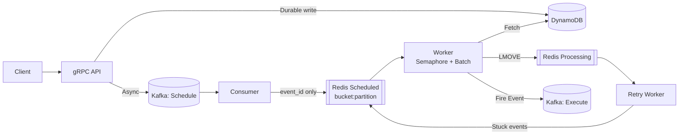

# Distributed Scheduler Service

A reliable, distributed scheduler for executing delayed events by publishing them to Kafka at (or after) a specified time.

Built for high throughput, fault tolerance, and horizontal scalability using **Redis**, **DynamoDB**, and **Kafka**.

## ✨ Key Features

- Schedule events **1 min – 15 days** in advance
- **At-least-once** execution with idempotency
- Handles crashes, retries, and partial failures
- Supports high concurrency **without hot partitions**
- Designed for **cross-service workflows**

## 🏗️ High-Level Architecture



## 🧠 Core Design

- **DynamoDB**: Stores event state and ensures idempotency
- **Redis**: Holds only event IDs in time-based buckets
- **Partitions**: Prevent hot shards and ensure fairness
- **Semaphore-based workers**: Control external load
- **Retry worker**: Recovers stuck or failed events

## ⚙️ Configuration

Correct tuning is **critical** for performance and stability.

| Parameter          | Description |
|--------------------|-------------|
| `bucket_size_sec`  | Time granularity of scheduling |
| `total_partitions` | Controls parallelism (**never reduce in prod**) |
| `batch_size`       | Events processed per batch |
| `semaphore_limit`  | Max concurrent external calls |

## 🔄 Execution Flow

1. Client schedules event via **gRPC**
2. Event persisted in **DynamoDB**
3. Event published to **Kafka schedule topic**
4. Consumer pushes event ID to **Redis bucket**
5. Worker drains due events, executes, and publishes to **Kafka execution topic**
6. **Retry worker** requeues failed or stuck events

## 🧪 Local Setup

```shell
make docker-up
```
Starts Kafka, Redis, DynamoDB local, and all services.

